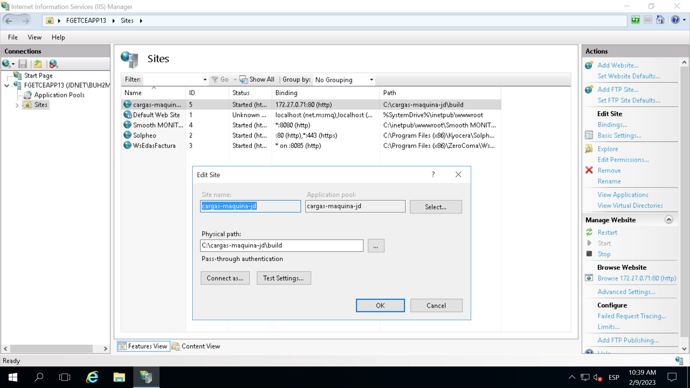

# Getting Started with Create React App

This project was bootstrapped with [Create React App](https://github.com/facebook/create-react-app).

## Ejecutar la aplicacion de forma local

Dentro del directorio de backend bastará con ejecutar el archivo *main.py* y dejarlo corriendo para que la aplicación funcione correctamente.

Para ejecutar la aplicación, acceder al archivo *package.json* y en el apartado **scripts** clicar sobre start. Tambien se puede ejecutar el comando `npm start`.

Se abrirá una página con la dirección [http://localhost:3000](http://localhost:3000) en el navegador.

La página se recargará cuando se hagan cambios y los errores se pueden observar en la consola.

## Desplegar la aplicacion en el servidor

La aplicación se lanzará en el servidor **fgetceapp13**. 

Empaquetar el código flask con pyinstaller `pyinstaller main.spec` en la terminal. Se genera un archivo ejecutable (`main.exe`).

Para poder lanzar la aplicación primero se debe realizar un build. En el  archivo *package.json* y en el apartado **scripts** clicar sobre ***build***. Tambien se puede ejecutar el comando `npm build`.

Se genera una carpeta `/build` que no será necesaria de subir al repositorio. 

Dentro del servidor se copian los archivos `/build` y `main.exe` en la carpeta `/cargas-maquina-jd` dentro del disco ***DRIVE_C***. 

En el servidor abrir la aplicación de Internet Information Services (IIS). En *Basic Settings* se puedeen ver los ajustes de la página.

Si la página no está creada se creará una nueva indicando el nombre y el camino a la carpeta `/build`. El IP address ([http://172.27.0.71/](http://172.27.0.71/)) se elige sobre los que haya disponibles.

Para poner en funcionamiento la aplicación con ejecutar el `main.exe` de pyinstaller. Solución temporal pasar a CGI.

